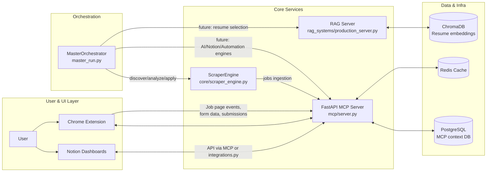

## AI Job Automation Agent

An AI-assisted system for end-to-end job search automation: multi-platform job discovery, AI-based analysis and resume selection, semi/fully automated applications, and structured tracking via MCP, Notion, and a Chrome extension.

This README consolidates the current codebase and the v2 architecture/requirements docs into one technical overview so you can understand, run, and extend the system without reading every file.

---

## PROJECT OVERVIEW

### Purpose, Goals, and Scope

- **Purpose**: Automate as much of the job application pipeline as safely possible while keeping a human in control for high‑value decisions.
- **Scope**:
  - Discover roles across many job platforms (JobSpy, Jooble, Remotive, SerpAPI Google Jobs, Playwright scrapers).
  - Analyze jobs against a candidate profile and resume set using a RAG system.
  - Generate optimized resumes and (in the final design) cover letters.
  - Submit applications automatically where safe, surface “dream jobs” for manual review.
  - Track everything centrally via MCP (PostgreSQL), Notion, and Chrome extension evidence capture.
- **Design docs**:
  - `assets/Architecture_v2_Specification.md` – hierarchical multi‑agent architecture v2.
  - `assets/System_Requirements_and_Constraints.md` – detailed FR/NFR/constraints and KPIs.

### Current Development Phase and Status

- **Status**: Advanced infrastructure and core services implemented; some orchestrator engines and the multi‑agent control layer are still partially or not yet implemented.
- **Production‑ready components**:
  - `mcp/server.py` – context management, evidence, and integrations service (FastAPI + Postgres + Redis).
  - `rag_systems/production_server.py` + `rag_systems/*` – production RAG server and resume engine on ChromaDB.
  - `core/scraper_engine.py` + `core/jobspy_adapter.py` + `scrapers/scraper_service.py` – multi‑platform scraping and scoring.
  - `chrome_extension/*` – Manifest v3 Chrome extension for job detection, auto‑fill, and MCP/Notion integration.
  - Dockerized infra for MCP, RAG, Postgres, Redis via `docker-compose.yml`.
- **Partially implemented / missing code relative to docs**:
  - `core/ai_engine.py`, `core/notion_engine.py`, `core/resume_engine.py`, `core/automation_engine.py` – referenced by orchestrator but not present in the repo.
  - Crew‑style “Developer Agent” and CrewAI multi‑agent orchestration are specified in docs but not wired into this codebase.
  - n8n workflows are referenced but not committed as `.json` definitions.

### Target Metrics (From Requirements Doc)

Planned KPIs (see `assets/System_Requirements_and_Constraints.md`):

- **Throughput**: ~150 applications/week (3 runs × 50 jobs) → ~600/month.
- **Automation rate**: ~70% auto‑apply, ~30% flagged for manual review (dream / complex jobs).
- **Quality**:
  - ≥90% successful auto‑applications (no errors).
  - 8–10% interview conversion rate from total applications.
- **Budget**:
  - Target LLM cost: **≤ \$6.45/month** (hard cap \$10/month).
  - Cost per application: **≤ \$0.013**.
- **Human time**: <5 hours/week of user oversight (manual review + manual applications + report review).

### Execution Model

High‑level execution model (as designed in v2 docs):

- **Frequency**: 3 scheduled runs per week (Mon/Thu/Sat @ 09:00 IST) plus 1 weekly optimization run (Sun @ 20:00 IST).
- **Batch strategy** (per run):
  - Discover ~50–100 relevant jobs across 10+ platforms.
  - Analyze each job (RAG + scoring) and split into:
    - **Auto‑apply** bucket (target ~70%).
    - **Manual (“dream job”)** bucket (target ~30%).
  - Apply automatically for the auto‑bucket; queue dream jobs for user via Notion + Chrome extension.
  - Log everything to MCP + Notion and expose metrics.
- **Execution entrypoint**:
  - `master_run.py` – async CLI orchestrator with modes:
    - `discover` – discovery only.
    - `analyze` – analysis only.
    - `apply` – applications only.
    - `full-automation` – full pipeline (discover → analyze → apply).
    - `health-check` – health/diagnostics.
  - Important: several underlying engines referenced by `master_run.py` (AI, Notion, automation) are currently missing, so not all modes run end‑to‑end without additional implementation.

---

## ARCHITECTURE

### Architectural Style

- **Macro pattern**: Service‑oriented architecture with:
  - **MCP service** (`mcp/server.py`) acting as a durable context, evidence, and integration hub.
  - **RAG service** (`rag_systems/production_server.py`) specializing in resume selection and RAG queries.
  - **CLI orchestrator** (`master_run.py`) that is intended to be the “Master Agent.”
  - **Scraper engine** (`core/scraper_engine.py`) and Playwright scrapers as dedicated worker subsystems.
  - **Chrome extension** as the primary in‑browser agent for manual/dream job flow.
- **Planned multi‑agent pattern** (from v2 spec):
  - Master Agent + Scraper, Analyzer, Apply, Tracker, and Developer Agents as logical roles.
  - Current code implements these *conceptually* via engines/services, but not as a formal multi‑agent runtime.

### High-Level Component Diagram (Mermaid)



### Data Flow Between Services (Implemented)

- **Scraping path**:
  1. `ScraperEngine.run()`:
     - Calls multiple scrapers in parallel:
       - `JobSpyAdapter` (LinkedIn, Indeed, Glassdoor, ZipRecruiter).
       - `JoobleAPIScraper`, `RemotiveAPIScraper`, `SerpAPIGoogleJobsScraper`.
       - (Design supports additional Playwright scrapers).
     - Normalizes, deduplicates, filters, and scores jobs.
  2. Downstream ingestion (planned, partially implemented):
     - Scraped jobs are intended to be pushed into MCP (`/ingest/jobs`) and/or Notion Applications DB via Notion engine or MCP integration.

- **Context & evidence path (MCP)**:
  - Every external event (Chrome extension webhooks, scrapers, Notion workflows, LLM calls) is modeled as:
    - **Session** (`sessions` table) – conversation or automation run.
    - **Context item** (`context_items`) – discrete messages, tool outputs, or job records.
    - **Snapshot** (`snapshots`) – summarized context.
    - **Evidence** (`evidence`) – structured proof of application, form extraction, etc.
  - MCP exposes HTTP endpoints used by the extension, orchestrator, and future agents.

- **RAG / resume selection path**:
  - `rag_systems/production_server.py` exposes `/rag/query` and `/rag/select` endpoints.
  - `rag_systems/resume_engine.py` orchestrates ChromaDB and an embedding model to:
    - Ingest and embed resumes.
    - Store chunk‑level and anchor‑level vectors.
    - Score resumes against job descriptions and select the best candidate.
  - The MCP server uses `mcp/integrations.py:RagClient` to connect to the RAG server and drive resume suggestion/selection endpoints.

- **Chrome extension integration**:
  - Content script (`chrome_extension/content.js`) detects job pages, extracts job metadata, and sends it to the background worker.
  - Background worker (`chrome_extension/background.js`) talks to MCP (e.g., `MCP_COMPLETE`, `JOB_DETECTED`, resume fetch) and Notion (via `notion_api.js` or webhooks).
  - MCP exposes `/webhook/chrome` and `/webhook/n8n` to ingest events, and provides endpoints for RAG and job analysis.

### Agent Responsibilities and Handoff Logic (Logical Roles)

The architecture docs define several “agents” that map to concrete components:

- **Master Agent / Orchestrator** (implemented as `MasterOrchestrator` in `master_run.py`):
  - Modes: `discover`, `analyze`, `apply`, `full-automation`, `health-check`.
  - Responsibilities:
    - Initialize core system (`core.initialize_core_system`).
    - Acquire engine instances: `get_ai_engine`, `get_notion_engine`, `get_scraper_engine`, `get_resume_engine`, `get_automation_engine`.
    - Drive phase‑by‑phase flows:
      - `run_job_discovery()`.
      - `run_job_analysis()`.
      - `run_automated_applications()`.
      - `run_full_automation()` (pipeline of the above).
      - `run_system_health_check()`.
    - Maintain run statistics (jobs discovered/analyzed, resumes generated, applications submitted).

- **Scraper Agent** (implemented as `ScraperEngine` + `JobSpyAdapter` + Playwright scrapers):
  - Scrapes multiple platforms in parallel, using:
    - **JobSpy**: LinkedIn, Indeed, Glassdoor, ZipRecruiter.
    - **Jooble API**: via `JoobleAPIScraper`.
    - **Remotive API**: via `RemotiveAPIScraper`.
    - **SerpAPI**: Google Jobs via `SerpAPIGoogleJobsScraper` with SerpAPI quota tracking (`ResourceManager`).
    - **Playwright**: site‑specific scrapers (Wellfound, WeWorkRemotely, RemoteOK, SimplyHired, StackOverflow, YC Startups, Hiring Cafe).
  - Normalizes and scores jobs based on YAML rules (see **Data Models**).

- **Analyzer Agent** (partially implemented in `master_run.py` + MCP RAG endpoints):
  - In the v2 design:
    - Uses match‑score logic (skills, RAG confidence, salary, location).
    - Splits into ~70% auto‑apply and ~30% manual review.
  - In current code:
    - `MasterOrchestrator.run_job_analysis()`:
      - Pulls jobs in status `DISCOVERED` from Notion (via `NotionEngine`, not committed).
      - Starts an AI session via `ai_engine`.
      - Calls AI analysis to determine match score and next status.
      - Updates Notion jobs with AI analysis, priority, and status.
    - MCP also exposes `/v1/job/analyze` integrating RAG for resume selection.
  - **Note**: The concrete `AIEngine` & `NotionEngine` classes are referenced but not present in this repo; behavior is defined by design docs.

- **Apply Agent** (partially implemented in `master_run.py` + extension + n8n design):
  - `run_automated_applications()`:
    - Selects high‑priority jobs from Notion via `NotionEngine`.
    - Generates optimized resumes via `ResumeEngine` (in `core.resume_engine`, not checked in).
    - Calls `ai_engine` to generate cover letters & company intelligence.
    - Uses `core.automation_engine.ApplicationJob` and `automation_engine.apply_to_job()` (both missing) to drive automation.
  - Playwright scrapers and the Chrome extension provide the building blocks for automated and assisted application flows.

- **Tracker Agent** (implemented partially across MCP + Notion integrations + extension):
  - MCP:
    - `EvidenceModel` and `/v1/sessions/{session_id}/evidence` store structured evidence JSON.
    - `/notion/create-job` endpoint (backed by `NotionClient` stub) is intended to log jobs/applications to Notion.
  - Chrome extension + `notion_api.js`:
    - Logs applications via webhooks to a Notion proxy.
  - The full Notion tracking DB automation (Applications + Dream Jobs DBs) is described in `assets/Architecture_v2_Specification.md` and `assets/System_Requirements_and_Constraints.md` but only partially backed by code stubs (`NotionClient`).

- **Developer Agent** (design‑only):
  - Weekly meta‑agent that analyzes metrics, error patterns, and cost, and updates config and prompts.
  - Not implemented in this repo; instead, the design docs serve as the specification for a future agent.

### Service Communication Protocols

- **MCP Server** (`mcp/server.py`):
  - **Protocol**: HTTP/JSON over FastAPI.
  - **Auth**: API key via `X-MCP-API-Key` header (`MCP_API_KEY`).
  - **Key endpoints** (see code for full list):
    - `/v1/sessions` – session lifecycle.
    - `/v1/sessions/{session_id}/items` – context CRUD.
    - `/v1/sessions/{session_id}/snapshot` – summarization (LLM or local).
    - `/v1/sessions/{session_id}/evidence` – attach evidence.
    - `/ingest/jobs` – job ingestion from scrapers.
    - `/v1/suggest-resume`, `/v1/job/analyze`, `/v1/relevant/{session_id}` – RAG and LLM integrations.
    - `/webhook/chrome`, `/webhook/n8n` – Chrome extension & n8n integration.
    - `/health`, `/ready`, `/metrics` – monitoring.

- **RAG Server** (`rag_systems/production_server.py`):
  - **Protocol**: HTTP/JSON (FastAPI).
  - **Auth**: `X-RAG-API-Key` header (various RAG_KEY_* env vars).
  - **Key endpoints**:
    - `/rag/query` – fetch relevant resume chunks/context.
    - `/rag/select` + `/resumes/select` – select best resume for a job.
    - `/resumes`, `/resumes/list`, `/resumes/reindex/{resume_id}` – resume management.
    - `/sessions/{session_id}` – per‑session context.
    - `/health`, `/metrics`.

- **Chrome Extension ↔ MCP**:
  - Background service worker uses plain `fetch` and `chrome.runtime.sendMessage` to:
    - Call MCP completion (`/llm/complete`) via `mcpClient` (see `chrome_extension/mcp_client.js`).
    - Hit custom MCP / RAG endpoints for resume generation and job analysis.
    - Send application logs and form data to MCP via webhooks.

---

## TECH STACK

### Languages

- **Python 3.11** (core services and orchestration).
- **JavaScript (ES modules)** for Chrome extension (Manifest v3).

### Frameworks and Libraries (Key)

- **Web / APIs**:
  - FastAPI (`fastapi`, `uvicorn`) – MCP and RAG servers.
  - Starlette under the hood.
- **ORM & DB**:
  - SQLAlchemy 2.x – async ORM in `mcp/server.py`.
  - Alembic listed in `requirements.txt` but migrations are not present.
- **Scraping & Automation**:
  - JobSpy – multi‑platform job aggregation (LinkedIn, Indeed, Glassdoor, ZipRecruiter).
  - Playwright – site‑specific scrapers and future automation flows (`scrapers/scraper_service.py`).
  - Requests, Scrapy, Selenium – available in dependencies; JobSpy/Playwright are the primary code paths used here.
- **RAG / ML**:
  - ChromaDB (`chromadb`) via `PersistentClient` – resume embeddings store.
  - `sentence-transformers` – embedding models (via `GeminiEmbedder` or fallbacks).
  - `nltk`, `spacy`, `scikit-learn` – ML/NLP toolkits available.
- **LLM Clients**:
  - `openai`, `perplexityai`, `anthropic` – available in requirements.
  - `mcp/integrations.py` currently focuses on:
    - NVIDIA NIM (DeepSeek model) and Perplexity as wrapped by `LLMRouter`.
  - OpenAI / Gemini keys are supported via `config/settings.py` and `mcp/server.py` envs.
- **Config & Settings**:
  - `pydantic-settings`, `python-dotenv`, `pyyaml`.
- **Extension tooling**:
  - Native Chrome extension APIs; no extra bundler/framework is used.

### Databases and Storage

- **PostgreSQL 15**:
  - Deployed via `docker-compose.yml` as `postgres` service.
  - Used by MCP server for context, sessions, evidence, and audit logs.
  - Data stored in `./postgres_data` (bind mount).
- **Redis 7**:
  - Deployed via `docker-compose.yml` as `redis` service.
  - Used by MCP and RAG for caching, rate limiting, and metrics.
  - Data stored in `./redis_data`.
- **ChromaDB**:
  - Persistent client configured via `rag_systems/chromadb_store.py`.
  - Default directory: `./.chroma` (bind‑mounted into the RAG container).

### Orchestration & Workflows

- **Docker Compose**:
  - `docker-compose.yml` orchestrates:
    - `postgres` – primary DB.
    - `redis` – cache / rate limit store.
    - `mcp-server` – MCP FastAPI service (built from `mcp/Dockerfile`).
    - `rag-server` – RAG FastAPI service (built from `rag_systems/Dockerfile`).
- **n8n** (mentioned in docs):
  - Not part of the current compose file; expected to run externally as separate infra.
  - Workflows are referenced (e.g., job automation) but not committed as JSON exports.

### Automation Tools

- **Playwright**:
  - Centralized through `scrapers/scraper_service.py` and `PlaywrightManager`.
  - Uses Webshare proxies from `narad.env`.
- **JobSpy**:
  - Core job aggregator used via `core/jobspy_adapter.py`.

### LLM Providers and Models (Configured / Used)

- **OpenAI**:
  - API keys & models configured in `config/settings.py`:
    - `OPENAI_API_KEY`, `OPENAI_MODEL`, `OPENAI_EMBEDDING_MODEL`.
- **Perplexity**:
  - `PERPLEXITY_API_KEY`, `PERPLEXITY_MODEL` (Sonar) used in `LLMRouter`.
- **NVIDIA NIM**:
  - `NVIDIA_NIM_API_KEY` – configured in `LLMRouter` for DeepSeek models.
- **Gemini**:
  - `GEMINI_API_KEY` and `GEMINI_API_KEY_RAG` env vars used by RAG embedding pipeline.

### APIs and Integrations

- **Notion**:
  - `NOTION_API_KEY`, `NOTION_APPLICATIONS_DB_ID`, `NOTION_JOB_TRACKER_DB_ID`.
  - `mcp/integrations.py:NotionClient` – stubbed client with todo markers for actual API calls.
  - `chrome_extension/notion_api.js` – robust background logging client used by extension.
- **Jooble API**:
  - `JOOBLE_API_KEY` required for `JoobleAPIScraper`.
- **SerpAPI**:
  - `SERPAPI_API_KEY_2` used by `SerpAPIGoogleJobsScraper` with resource tracking.
- **Playwright Webshare Proxies**:
  - `WEBSHARE_PROXY_2_1` … `WEBSHARE_PROXY_2_10` (and `PROXY_*` variants) loaded by `scrapers/scraper_service.py`.

### Infrastructure and Hosting

- Designed to run locally or on a small VPS:
  - Docker Compose only (no Kubernetes).
  - All state kept in mounted volumes under the project directory.
- External services:
  - Notion SaaS, LLM APIs, and SerpAPI/Jooble are the main paid/hosted dependencies.

---

## PROJECT STRUCTURE

High‑level structure (only primary components listed):

```text
.
├── assets/                     # Architecture and requirements docs
│   ├── Architecture_v2_Specification.md
│   └── System_Requirements_and_Constraints.md
├── config/
│   └── settings.py             # Central configuration & env handling
├── core/
│   ├── __init__.py             # Engine initialization & health orchestration
│   ├── scraper_engine.py       # Multi-source scraping, normalization, scoring
│   └── jobspy_adapter.py       # JobSpy-based scraping adapter
├── mcp/
│   ├── server.py               # MCP FastAPI server (sessions, context, evidence, webhooks)
│   ├── integrations.py         # RAG, LLM, Notion, and Scraper client abstractions
│   ├── cache.py                # Cache/compressor abstractions (Redis / zstd)
│   └── security.py             # Auth, rate limiting, audit logging (referenced; may be partial)
├── rag_systems/
│   ├── production_server.py    # Production RAG FastAPI server
│   ├── resume_engine.py        # Resume ingestion and selection engine
│   ├── chromadb_store.py       # ChromaDB v1 wrapper
│   ├── rag_api.py              # Core API functions for rag_server
│   └── resume_config.json      # Resume catalog and metadata
├── scrapers/
│   ├── scraper_service.py      # Playwright-based site scrapers & proxy mgmt
│   └── __init__.py
├── chrome_extension/
│   ├── manifest.json           # Manifest v3 declaration
│   ├── background.js           # Service worker (MCP & Notion integration)
│   ├── content.js              # In-page job detection & form automation
│   ├── popup.{html,js}         # Popup UI to control automation
│   ├── sidebar.{html,js,css}   # Side-panel UI (if used)
│   ├── extension_config.js     # Shared config/constants for extension
│   ├── mcp_client.js           # MCP client used by background worker
│   └── notion_api.js           # Notion logging helper (queue + retries)
├── scripts/
│   ├── start_production.sh     # Convenience wrappers for Docker stack
│   ├── stop_production.sh
│   ├── status.sh
│   └── test_e2e.sh             # (If present) End-to-end test harness
├── postgres_data/              # Postgres volume (created at runtime)
├── redis_data/                 # Redis volume (created at runtime)
├── n8n_data/                   # Placeholder for n8n state (not wired in compose)
├── master_run.py               # High-level orchestrator CLI
├── docker-compose.yml          # Infra stack (Postgres, Redis, MCP, RAG)
└── requirements.txt            # Python dependencies (pinned)
```

### Entry Points and Main Scripts

- **Orchestrator**:
  - `master_run.py` – primary CLI:
    - `python master_run.py --mode discover|analyze|apply|full-automation|health-check [--limit N]`.
- **Services**:
  - MCP: `mcp/server.py` – run via Docker (`mcp/Dockerfile`) or `uvicorn mcp.server:app`.
  - RAG: `rag_systems/production_server.py` – run via Docker (`rag_systems/Dockerfile`) or `uvicorn rag_systems.production_server:app`.
- **RAG ingestion**:
  - `rag_systems/ingest_all_resumes.py` – script to index all resumes into Chroma.

### Configuration Files

- `config/settings.py`:
  - Centralized config; builds `Settings` object with nested sections for AI, Notion, Overleaf, Gmail, scraping, Playwright, system, security, and logging.
  - Exposes `get_settings()` for use across the app.
- `core/job_filters.yaml` (referenced; actual file lives under `core/` or `config/` depending on branch):
  - YAML config for search criteria and scoring rules.
- `rag_systems/resume_config.json`:
  - Defines resume catalog and metadata for RAG ingestion.
- `docker-compose.yml`:
  - Infra topology and service env wiring.
- `narad.env` (not in repo, must be created by you):
  - Central env file referenced by Docker Compose and services.

---

## IMPLEMENTED FEATURES

### Agent Implementations (Concrete)

- **MasterOrchestrator** (`master_run.py`):
  - Modes for discovery, analysis, applications, full automation, and health check.
  - Asynchronous implementation with detailed logging and JSON execution summaries.
  - Tracks aggregate stats (jobs, resumes, applications, errors, execution times).

- **ScraperEngine** (`core/scraper_engine.py`):
  - Loads job filters from YAML.
  - Registers scrapers:
    - `JobSpyAdapter` – LinkedIn, Indeed, Glassdoor, ZipRecruiter.
    - `JoobleAPIScraper` – Jooble official API.
    - `RemotiveAPIScraper` – Remotive public API.
    - `SerpAPIGoogleJobsScraper` – Google Jobs via SerpAPI with credit tracking.
  - Applies:
    - Normalization (`Normalizer`).
    - Hard filters (`FilterEngine`) from YAML.
    - Scoring (`ScoringEngine`) to compute `relevance_score` and `decision` (e.g., accept/reject).
    - Deduplication (`job_id` hash on title|company|url).
  - Produces metrics: counts, distribution by score ranges, jobs/minute, per‑scraper stats.

- **JobSpyAdapter** (`core/jobspy_adapter.py`):
  - Safe wrapper around JobSpy library:
    - Patches `Country.from_string` to handle invalid inputs.
    - Filters to allowed sites (LinkedIn, Indeed, ZipRecruiter, Glassdoor).
    - Handles NaN/None values, normalizes locations, ensures safe strings.
  - Returns raw job dictionaries (title, company, location, job_url, description, source, etc.).

- **Playwright scrapers** (`scrapers/scraper_service.py`):
  - `PlaywrightManager`:
    - Loads up to 10 Webshare static proxies from `narad.env`.
    - Maintains a single hardened Chromium instance and rotates proxies.
  - Site‑specific scrapers:
    - `WellfoundScraper`, `WeWorkRemotelyScraper`, `RemoteOKScraper`, `SimplyHiredScraper`, `StackOverflowScraper`, `YCStartupScraper`, `HiringCafeScraper`.
  - Shared base class with:
    - Retry logic, exponential backoff.
    - Scrolling and selector‑based extraction.

- **MCPService** (`mcp/server.py`):
  - Async context management with SQLAlchemy models:
    - `SessionModel`, `ContextItemModel`, `SnapshotModel`, `EvidenceModel`, `AuditLogModel`.
  - High‑level operations:
    - Session management, context append/retrieve/replace, trust/deprecate flags.
    - Summarization via local extractive summarizer or LLM (`LLMRouter`).
    - Evidence attachment and tracking.
    - Background cleanup of expired sessions.
  - API surface:
    - Rich set of `/v1/sessions/**`, `/v1/relevant/{session_id}`, `/v1/suggest-resume`, `/llm/complete`, `/ingest/jobs`, `webhook` endpoints, and monitoring routes.

- **RAG Resume Engine** (`rag_systems/resume_engine.py`, `rag_systems/chromadb_store.py`, `rag_systems/rag_api.py`, `rag_systems/production_server.py`):
  - Ingestion pipeline:
    - Loads resume config (`resume_config.json`).
    - Extracts text from PDFs (PyPDF2).
    - Chunks texts, embeds chunks, and upserts into Chroma.
    - Creates anchor vectors combining config keywords + PDF anchor text.
  - Selection pipeline:
    - Embeds job text, queries anchors and chunk vectors.
    - Combines anchor similarity and chunk scores with metadata bonuses into a final score.
    - Returns top resume ID, score, path, and detailed candidate ranking.
  - RAG HTTP server:
    - Exposes health, RAG query, selection, resume management, metrics.
    - Implements rate limiting, cache, session management, and a small observability layer.

- **Chrome Extension** (`chrome_extension/*`):
  - Manifest v3 with:
    - Background service worker (`background.js`) – orchestrates MCP calls, Notion logging, storage, and context menus.
    - Content script (`content.js`) – detects job pages, extracts job data, controls in‑page overlay, auto‑fills forms with user profile and dynamic resumes, detects submissions.
    - Popup UI (`popup.html`, `popup.js`) – controls automation settings, displays stats, monitors MCP connectivity.
    - Side panel UI (`sidebar.html`, `sidebar.js`) – optional advanced UI for context & activity monitoring.
    - `extension_config.js` – centralizes constants, storage keys, feature flags, command IDs, etc.
    - `notion_api.js` – robust, queue‑backed Notion logging client.

### Implemented Platform Scrapers

From `core/jobspy_adapter.py`, `core/scraper_engine.py`, and `scrapers/scraper_service.py`:

- **JobSpy-based**:
  - LinkedIn.
  - Indeed.
  - Glassdoor.
  - ZipRecruiter.
- **Public / Official APIs**:
  - Jooble (`JoobleAPIScraper`) – requires `JOOBLE_API_KEY`.
  - Remotive (`RemotiveAPIScraper`) – no key required.
  - Google Jobs via SerpAPI (`SerpAPIGoogleJobsScraper`) – requires `SERPAPI_API_KEY_2`.
- **Playwright-based**:
  - Wellfound.
  - WeWorkRemotely.
  - RemoteOK.
  - SimplyHired.
  - StackOverflow Jobs.
  - YC Startup Jobs.
  - Hiring Cafe.

### n8n Workflows

- The architecture docs specify n8n workflows for:
  - Job application automation (trigger Playwright flows).
  - Error notification.
  - Possibly scraping orchestration.
- **Current repo**:
  - Contains `n8n_data/` as a volume directory but **no workflow JSON files**.
  - You will need to author and import workflows in your own n8n instance.

### RAG System Components

- **Collections**:
  - Single `resumes` collection (configurable via `CHROMA_COLLECTION`) used for chunk and anchor vectors.
- **Embeddings & models**:
  - `GeminiEmbedder` by default when `GEMINI_API_KEY_RAG` is set; `LocalDeterministicEmbedder` fallback for dev/testing.
- **APIs**:
  - `/rag/query`, `/rag/select`, `/resumes/select`, `/resumes/reindex/{resume_id}`, `/resumes/list`, `/health`, `/metrics`.

### Chrome Extension Features (Current)

- Job detection on major platforms (LinkedIn, Indeed, Naukri, Wellfound, various remote job boards).
- Quick actions overlay:
  - Analyze job via MCP LLM.
  - Auto‑fill application forms using stored profile and dynamic resume generation.
- Communication with MCP for:
  - LLM completions.
  - Resume suggestions / dynamic resumes.
  - Logging job detections and applications.
- Notion logging via webhook or `NotionAPI` client.

### API Endpoints (Selected)

See `mcp/server.py` and `rag_systems/production_server.py` for complete lists; some key ones:

- MCP:
  - `/v1/sessions`, `/v1/sessions/{session_id}`, `/v1/sessions/{session_id}/items`.
  - `/v1/suggest-resume` – RAG‑powered resume suggestion.
  - `/v1/job/analyze` – job analysis + resume selection.
  - `/llm/complete` – generic LLM completion via `LLMRouter`.
  - `/ingest/jobs`, `/webhook/chrome`, `/webhook/n8n`.
  - `/health`, `/ready`, `/metrics`.
- RAG:
  - `/rag/query`, `/rag/select`, `/resumes/select`, `/resumes/list`, `/resumes/reindex/{resume_id}`, `/health`, `/metrics`.

---

## NOT YET IMPLEMENTED / GAPS

### Planned Features Not Fully Coded

- **AI Engine**:
  - `core/ai_engine.py` – referenced in `core/__init__.py` and `master_run.py` but not present.
  - AI behaviors (job analysis, company research, cover letters) described in docs but lack implementation here.

- **Notion Engine**:
  - `core/notion_engine.py` – referenced for ApplicationStatus enums and Notion DB interactions but missing.
  - Current Notion integration is partially stubbed via `mcp/integrations.py:NotionClient` and the Chrome extension’s `notion_api.js` rather than a full backend engine.

- **Automation Engine**:
  - `core/automation_engine.py` – referenced for `ApplicationJob` and `apply_to_job` but not present.
  - Playwright scrapers exist, but full ATS‑aware automatic application engine is incomplete.

- **CrewAI multi-agent layer & Developer Agent**:
  - Multi‑agent orchestration and Developer Agent are specified in `assets/Architecture_v2_Specification.md` but not implemented in this codebase.

- **n8n integration**:
  - Workflows described (job automation, error notification) are not checked in.
  - n8n is expected to be deployed separately and wired to MCP/Playwright via webhooks.

- **Prometheus / Grafana**:
  - Some `/metrics` endpoints exist (MCP, RAG), but full Prometheus/Grafana stack is not defined in this repo.

### Incomplete Integrations / Stubs

- `mcp/integrations.py:NotionClient`:
  - Methods like `create_job_entry`, `update_job_status`, `query_jobs` are very light or stubbed; TODO comments note that real Notion API calls should be added.

- `mcp/integrations.py:ScraperClient`:
  - `trigger_scrape` and `_scrape` are stubs simulating responses instead of calling real scrapers.

- `mcp/server.py`:
  - Security and rate‑limiter integrations rely on `security.py` and `cache.py` factories, which may be partial depending on branch; rate limit logic is mostly TODO.
  - Some TODOs for background RAG matching and Notion entry creation.

---

## CURRENT STATE

### What Works End-to-End Today

- MCP server:
  - Can be run via Docker Compose and handles sessions, context items, snapshots, and evidence.
  - Provides webhooks for Chrome extension and generic job ingestion.
  - Integrates with a running RAG server and Redis (if configured).

- RAG server:
  - Can ingest resumes via `ingest_all_resumes.py`.
  - Serves resume selection and query endpoints.
  - Maintains Chroma collections on disk.

- Scraper engine:
  - Can be invoked programmatically (e.g., from a small script or future CLI) to scrape configured sources and return scored job objects.

- Chrome extension:
  - Detects jobs, auto‑fills forms, talks to MCP and Notion, and surfaces a UI overlay and popup.

### What Requires Manual Intervention

- Orchestrated end‑to‑end pipeline (discover → analyze → apply) via `master_run.py`:
  - Because `ai_engine`, `notion_engine`, `resume_engine`, and `automation_engine` modules are missing, you cannot currently run the full automation workflow without implementing those engines or mocking them.
  - To experiment, you can:
    - Use ScraperEngine independently.
    - Use MCP and RAG independently.
    - Use the Chrome extension for manual/dream‑job flows while you manually manage Notion DBs.

### Known Issues / Blockers

- Missing core engine modules (AI, Notion, Automation, Resume) block:
  - `run_job_discovery` → Notion Applications DB writes.
  - `run_job_analysis` → AI scoring and Notion updates.
  - `run_automated_applications` → resume generation & application submission.
- Some MCP routes reference `rag_client`, `llm_router`, and `notion_client` which require `mcp/integrations.py` to be fully configured and `narad.env` to be populated.
- Rate limiting and security modules have TODO sections; production‑grade security should be reviewed before exposing publicly.

---

## DATA MODELS

### PostgreSQL Schema (MCP)

Defined via SQLAlchemy ORM in `mcp/server.py`:

- `sessions` (`SessionModel`):
  - `session_id` (PK, UUID string).
  - `owner`, `created_at`, `last_active_at`, `meta_json`, `ttl_hours`, `is_active`, `version`.
  - Indexed by `last_active_at`, `owner`.

- `context_items` (`ContextItemModel`):
  - `item_id` (PK).
  - `session_id` (FK‑like string).
  - `role` (`system|user|assistant|tool`).
  - `content` (text, possibly compressed).
  - `vector_id` (optional).
  - `created_at`, `meta_json`, `trusted`, `deprecated`, `sequence`, `compressed`.
  - Indexed by `session_id + sequence`, `session_id + created_at`, `role`.

- `snapshots` (`SnapshotModel`):
  - Summary of session context with `snapshot_id`, `session_id`, `summary_text`, `method`, timestamps, metadata.

- `evidence` (`EvidenceModel`):
  - `evidence_id` (PK).
  - `session_id`.
  - `attached_to` (context item or resource id).
  - `data` (JSON string).
  - `created_at`, `meta_json`.

- `audit_logs` (`AuditLogModel`):
  - Immutable audit trail: `log_id`, `session_id`, `actor_type`, `actor_id`, `action`, `resource_type`, `resource_id`, `outcome`, `error_message`, `audit_metadata`, `ip_address`, `timestamp`.

### RAG / ChromaDB Collections

From `rag_systems/chromadb_store.py` and `rag_systems/resume_engine.py`:

- Default `ChromaStoreConfig`:
  - `persist_dir`: `./.chroma` (or `CHROMA_DIR`).
  - `collection_name`: `"resumes"` (or `CHROMA_COLLECTION`).
- Stored documents:
  - Chunk embeddings for resumes:
    - Metadata: `resume_id`, `chunk_id`, `offset`, `token_count`, `section_heading`.
  - Anchor vectors:
    - Metadata: `resume_id`, `anchor: True`, `role_focus`, `embedding_version`, `label`.

### Resume Catalog (JSON)

- `rag_systems/resume_config.json`:
  - Contains an array of resumes:
    - `resume_id`, `label`, `role_focus`, `languages`, `local_path`, `embedding_version`.
  - `ResumeEngine` builds an internal `ResumeEntry` for each and associates a `vector_anchor_id`.

### Job Lifecycle & States

From docs + inferred code:

- Logical statuses in Notion (`ApplicationStatus` enum, partially present in `master_run.py`):
  - `DISCOVERED`, `STAGED_FOR_AUTO_APPLY`, `MANUAL_REVIEW_REQUIRED`, `REJECTED`.
- Chrome extension adds UI‑level statuses and emoji codes for manual flows.
- The detailed state machine described in `assets/Architecture_v2_Specification.md` is not fully enforced by code yet but can be mapped to Notion select properties and MCP status fields.

### Configuration Data Structures

- `config/settings.py:Settings`:
  - Aggregates:
    - `AIConfig`, `NotionConfig`, `OverleafConfig`, `GmailConfig`, `ScrapingConfig`, `PlaywrightConfig`, `SystemConfig`, `SecurityConfig`, `LoggingConfig`.
  - Provides helper methods:
    - `load_job_filters()` – load job filters from YAML.
    - `load_resume_template()` – load resume template from JSON.
    - `get_supported_platforms()`, `get_ai_providers()`, `to_dict()`.

- `core/job_filters.yaml`:
  - Search criteria: job titles, keywords, locations, date ranges.
  - Filtering rules: must‑have / nice‑to‑have criteria.
  - Scoring config: weights and thresholds for `ScoringEngine`.

---

## CONFIGURATION

### Environment Variables (from code; no values here)

From `config/settings.py`:

- AI:
  - `OPENAI_API_KEY`, `OPENAI_MODEL`, `OPENAI_EMBEDDING_MODEL`, `OPENAI_TEMPERATURE`, `OPENAI_MAX_TOKENS`.
  - `PERPLEXITY_API_KEY`, `PERPLEXITY_MODEL`, `PERPLEXITY_TEMPERATURE`.
  - `MCP_SERVER_URL`, `MCP_CLIENT_TIMEOUT`, `MCP_MAX_RETRIES`, `MCP_CONTEXT_WINDOW_SIZE`.
- Notion:
  - `NOTION_API_KEY`, `NOTION_APPLICATIONS_DB_ID`, `NOTION_JOB_TRACKER_DB_ID`, `NOTION_VERSION`, `NOTION_TIMEOUT`, `NOTION_MAX_RETRIES`.
- Overleaf & Gmail:
  - `OVERLEAF_API_KEY`, `OVERLEAF_PROJECT_ID`, `OVERLEAF_COMPILE_URL`, `OVERLEAF_TIMEOUT`.
  - `GMAIL_CLIENT_ID`, `GMAIL_CLIENT_SECRET`, `GMAIL_REDIRECT_URI`, `GMAIL_SCOPES`, `GMAIL_CHECK_INTERVAL`.
- Scraping & platforms:
  - `SCRAPING_DELAY_MIN`, `SCRAPING_DELAY_MAX`, `MAX_CONCURRENT_SCRAPERS`, `USER_AGENT`, `SCRAPING_TIMEOUT`, `SCRAPING_MAX_RETRIES`.
  - `LINKEDIN_EMAIL`, `LINKEDIN_PASSWORD`, `INDEED_API_KEY`.
- Playwright:
  - `PLAYWRIGHT_SERVICE_URL`, `PLAYWRIGHT_HEADLESS`, `PLAYWRIGHT_TIMEOUT`, `PLAYWRIGHT_VIEWPORT_WIDTH`, `PLAYWRIGHT_VIEWPORT_HEIGHT`, `SAVE_SCREENSHOTS`.
- System & security:
  - `TIMEZONE`, `DAILY_RUN_TIME`, `MAX_APPLICATIONS_PER_DAY`, `MIN_JOB_MATCH_SCORE`.
  - `HIGH_PRIORITY_DAYS`, `MEDIUM_PRIORITY_DAYS`, `LOW_PRIORITY_DAYS`.
  - `ENCRYPTION_KEY`, `JWT_SECRET`, `SESSION_TIMEOUT`, `EXTENSION_API_SECRET`.
- Logging & modes:
  - `LOG_LEVEL`, `LOG_FILE_PATH`, `LOG_MAX_FILE_SIZE`, `LOG_BACKUP_COUNT`, `VERBOSE_LOGGING`.
  - `DEBUG_MODE`, `TEST_MODE`, `MOCK_APPLICATIONS`.

From `mcp/server.py`:

- MCP / DB / cache:
  - `MCP_DEV_MODE` (alias for `dev_mode`).
  - `MCP_API_KEY`, `JWT_SECRET`, `JWT_EXPIRY_HOURS`.
  - `DATABASE_URL`, `DB_POOL_SIZE`, `DB_MAX_OVERFLOW`, `DB_POOL_TIMEOUT`.
  - `REDIS_URL`, `REDIS_ENABLED`.
  - `RATE_LIMIT_ENABLED`, `RATE_LIMIT_REQUESTS`, `RATE_LIMIT_WINDOW`.
  - `SESSION_TTL_HOURS`, `CLEANUP_INTERVAL_SECONDS`.
  - `MAX_PAGE_SIZE`, `COMPRESSION_THRESHOLD`.
- LLM & RAG:
  - `GEMINI_API_KEY`, `GEMINI_BASE`.
  - `OPENROUTER_API_KEY`, `OPENROUTER_BASE`.
  - `PERPLEXITY_API_KEY`.
  - `GROK_API_KEY` (if used).
  - `RAG_BASE_URL`, `RAG_KEY_MCP`.
- Logging:
  - `LOG_LEVEL` (again, specific to MCP).

From `mcp/integrations.py`:

- RAG:
  - `RAG_BASE_URL`, `RAG_TIMEOUT`, `RAG_KEY_MCP` (used to build `RagClient`).
- LLMRouter:
  - `NVIDIA_NIM_API_KEY`.
  - `PERPLEXITY_API_KEY`, `PERPLEXITY_MODEL`.
- Notion:
  - `NOTION_API_KEY`, `NOTION_DATABASE_ID`.
- Scraping:
  - `JOOBLE_API_KEY`.

From `rag_systems/*`:

- `GEMINI_API_KEY_RAG`, `CHROMA_DIR`, `CHROMA_COLLECTION`.

From `scrapers/scraper_service.py`:

- `WEBSHARE_PROXY_2_1` … `WEBSHARE_PROXY_2_10`, `PROXY_1` … `PROXY_10`.

From `docker-compose.yml`:

- All services use:
  - `POSTGRES_USER`, `POSTGRES_PASSWORD`, `POSTGRES_DB`.
  - `DATABASE_URL`, `REDIS_URL` (overridden for MCP & RAG).
  - Shared `env_file: ~/narad.env`.

### Platform Configuration

- Job platform behavior is largely driven by:
  - `config/job_filters.yaml` (or `core/job_filters.yaml`).
  - Scoring weights and thresholds in YAML.
  - Environment‑level credentials for APIs and logins.

### Feature Flags / Thresholds

- `SystemConfig` (from `config/settings.py`):
  - `max_applications_per_day` – global cap enforced in `MasterOrchestrator.run_full_automation()`.
  - `min_job_match_score` – planned threshold for auto‑apply decisions.
- `ScoringEngine` (in `core/scraper_engine.py`):
  - Interprets YAML rules to assign `decision` labels (e.g., reject vs keep).

---

## SETUP & INSTALLATION

### Prerequisites

- Python 3.11 (for local development).
- Docker + Docker Compose (for running MCP, RAG, Postgres, Redis).
- Node/Chrome for extension development (Chrome or Chromium‑based browser).
- Access tokens/keys:
  - MCP API key, RAG API keys, LLM keys (OpenAI, Gemini, Perplexity, NVIDIA NIM).
  - Notion integration key and DB IDs.
  - SerpAPI, Jooble, platform credentials (LinkedIn, etc.).

### 1. Clone and Create Virtual Environment

```bash
git clone <your-fork-or-repo-url> AI_Job_Automation_Agent
cd AI_Job_Automation_Agent
python -m venv venv
source venv/bin/activate  # Windows: venv\Scripts\activate
pip install -r requirements.txt
```

### 2. Create `narad.env`

Create `~/narad.env` (or adjust paths in `docker-compose.yml` and code) and populate it with all required env vars (no values included here):

```bash
OPENAI_API_KEY=...
PERPLEXITY_API_KEY=...
GEMINI_API_KEY=...
GEMINI_API_KEY_RAG=...
NVIDIA_NIM_API_KEY=...
NOTION_API_KEY=...
NOTION_APPLICATIONS_DB_ID=...
NOTION_JOB_TRACKER_DB_ID=...
JOOBLE_API_KEY=...
SERPAPI_API_KEY_2=...
LINKEDIN_EMAIL=...
LINKEDIN_PASSWORD=...
INDEED_API_KEY=...
MCP_API_KEY=...
RAG_KEY_MCP=...
POSTGRES_USER=ai_user
POSTGRES_PASSWORD=...
POSTGRES_DB=ai_job_db
REDIS_URL=redis://redis:6379/0
CHROMA_DIR=/app/.chroma
CHROMA_COLLECTION=resumes
# ... plus any others from config/settings.py or mcp/server.py as needed
```

> **Note**: The system is designed to centralize secrets in `narad.env`. Do **not** commit this file.

### 3. Start Core Services (Docker)

From the repo root:

```bash
docker-compose up -d
```

This will:

- Start Postgres (`postgres`).
- Start Redis (`redis`).
- Build and start MCP (`mcp-server`) on `http://localhost:3001`.
- Build and start RAG (`rag-server`) on `http://localhost:8090`.

Check health:

```bash
curl http://localhost:3001/health
curl http://localhost:8090/health
```

### 4. Ingest Resumes into RAG

With services running and `GEMINI_API_KEY_RAG` (or fallback) set:

```bash
source venv/bin/activate
python rag_systems/ingest_all_resumes.py
```

This will read `rag_systems/resume_config.json`, open each resume PDF, and populate ChromaDB.

### 5. Load Chrome Extension

1. Open Chrome → `chrome://extensions`.
2. Enable **Developer mode**.
3. Click **Load unpacked** and select the `chrome_extension/` folder.
4. Confirm that:
   - The extension appears as “AI Job Automation Agent”.
   - Permissions and host permissions match your job sites.

Configure extension settings (via popup) and ensure MCP base URLs and API keys in `extension_config.js` align with your local environment.

---

## RUNNING THE SYSTEM

### 1. Running MCP and RAG (Production Mode)

Use Docker Compose as above. Logs are available under `./logs` for services that mount this directory.

### 2. Local Development of MCP or RAG

For quick iterations, you can run servers directly:

```bash
# MCP
uvicorn mcp.server:app --host 0.0.0.0 --port 3001 --reload

# RAG
uvicorn rag_systems.production_server:app --host 0.0.0.0 --port 8090 --reload
```

Ensure `DATABASE_URL`, `REDIS_URL`, and RAG keys are set in your shell or `.env`.

### 3. Triggering a Batch Run (Orchestrator)

**Warning**: Full automation modes depend on missing engines; treat these as skeletons unless you implement `core/ai_engine.py`, `core/notion_engine.py`, `core/resume_engine.py`, and `core/automation_engine.py`.

From the repo root (with venv active):

```bash
python master_run.py --mode discover --limit 50
python master_run.py --mode analyze --limit 20
python master_run.py --mode apply --limit 10
python master_run.py --mode full-automation
python master_run.py --mode health-check
```

Suggested approach while engines are incomplete:

- Use `discover` mode only once engines are implemented, or call `ScraperEngine` directly from a small script to fetch and inspect jobs.

### 4. Manual Testing Procedures

- **ScraperEngine smoke test**:

```python
from core.scraper_engine import ScraperEngine
import asyncio

async def main():
    engine = ScraperEngine()
    jobs, metrics = await engine.run()
    print(f"Got {len(jobs)} scored jobs")
    print(metrics)

asyncio.run(main())
```

- **MCP context test**:
  - Start MCP.
  - `POST /v1/sessions` to create a session.
  - `POST /v1/sessions/{session_id}/items` to add context.
  - `GET /v1/sessions/{session_id}/items` to verify.

- **RAG test**:
  - After ingesting resumes, call `/resumes/list` and `/resumes/select` with sample job text.

### 5. Dry-Run Mode

- There is no explicit “dry-run” flag, but you can:
  - Set `TEST_MODE=true` and `MOCK_APPLICATIONS=true` in env to relax strict config and avoid real submissions.
  - Wire your engines to skip real Notion/Playwright calls under test mode.

### 6. Debugging Tips

- Check logs:
  - `logs/` directory (mounted for MCP and RAG).
  - `playwright_scrapers.log`.
  - `automation.log` from `master_run.py`.
- Use `/health` and `/ready` endpoints for MCP and RAG to verify DB/Redis health.
- Inspect Postgres tables for MCP data (`sessions`, `context_items`, `evidence`, `audit_logs`).
- Use Chrome DevTools for extension debugging (background & content scripts).

---

## DEPENDENCIES & EXTERNAL SERVICES

### External APIs & Rate Limits

- **Job platforms**:
  - JobSpy uses public/job‑board endpoints; respect any robots.txt and ToS.
  - Jooble, Remotive, and SerpAPI enforce their own rate limits – the code includes SerpAPI quota tracking.
- **LLM APIs**:
  - OpenAI, Perplexity, NVIDIA NIM, Gemini – rate limits and quotas apply; ensure your keys are configured and budgets monitored.
- **RAG**:
  - ChromaDB is local; calls are intra‑container.

### Docker Services and Networking

- Compose network: `ai_job_network` (bridge).
- Services:
  - `postgres:5432` – internal hostname `postgres`.
  - `redis:6379` – internal hostname `redis`.
  - `mcp-server:3001` – published to host `localhost:3001`.
  - `rag-server:8090` – published to host `localhost:8090`.
- Chrome extension and n8n (external) call MCP and RAG via `http://localhost:3001` and `http://localhost:8090`.

---

## GAPS & MISSING PIECES

### Missing Diagrams / Docs

- High‑level diagrams exist in `assets/Architecture_v2_Specification.md`. There is no separate diagrams folder or exported images in this repo.
- Monitoring and cost dashboards are described but not wired to a concrete Prometheus/Grafana deployment here.

### Error Handling & Security

- MCP server has strong patterns (audit logs, evidence, auth via API key), but:
  - JWT‑based auth, service accounts, and full rate‑limiting logic are partially TODO.
  - Cache health checks and Redis resiliency are incomplete.
- Scrapers and Playwright scrapers log errors but do not yet implement all the platform‑safe heuristics described in the design docs (e.g., strict per‑platform quotas, 70/30 auto/manual split).

### Testing Coverage

- `pytest` and related libs are included, but there is no visible test suite in this snapshot.
- Before deploying to production, implement:
  - Unit tests for MCP service behavior.
  - Integration tests for RAG selection, scraping, and extension interactions.

### Documentation Holes

- This README replaces several implied docs in the architecture/spec files but:
  - There is no dedicated “MCP API reference” or OpenAPI doc exported.
  - There is no developer guide for adding new platforms, resumes, or agents.

---

## KEY DESIGN DECISIONS

- **Central context hub (MCP)**:
  - All agent interactions, webhooks, and evidence are funneled through a single FastAPI service, backed by Postgres and Redis.
  - This enables auditing, replay, and RAG‑friendly context retrieval.

- **Separate RAG service**:
  - Resume selection is separated from MCP and orchestrator logic to keep the RAG pipeline specialized, testable, and horizontally scalable.

- **Lean data stack**:
  - Only Postgres, Redis, Chroma, and Notion – avoids heavy multi‑DB architectures.

- **Chrome extension for high‑value flows**:
  - Rather than pushing every application through backend automation, “dream jobs” and complex flows are handled via browser automation and user‑assisted workflows.

- **Config‑driven scoring and scraping**:
  - YAML and JSON configs drive job filters, scoring, and resume catalog, making adaptation easier without code changes.

---

## MONITORING & OBSERVABILITY

### Logging Strategy

- **Python services**:
  - Use `logging` + RichHandler (MCP) and/or standard logging with file and stream handlers.
  - Logs for MCP and RAG can be mounted to `./logs`.
- **Extension**:
  - Uses console logging behind feature flags (debug mode).
  - Activity logs persisted to `chrome.storage.local`.

### Metrics

- MCP and RAG:
  - Provide `/metrics` JSON endpoints summarizing internal counters (sessions created, items appended, snapshots created, webhooks received, auth failures, cache hits/misses).
- Future Prometheus/Grafana:
  - Docs describe desired dashboards and alerts (system health, pipeline, cost, platform performance), but scraping/export of metrics in Prometheus format is not implemented in this repo.

### Error Handling Patterns

- Retry decorators (MCP) and explicit try/except blocks with logging.
- Proxy pools and resource managers (SerpAPI) to soften external failures.
- TODOs for full circuit breakers and rate limiter enforcement in security/cache layers.

---

## DEPLOYMENT

### Current Deployment Method

- **Local / single‑host deployment**:
  - Docker Compose orchestrating:
    - MCP server container (Python + FastAPI).
    - RAG server container.
    - Postgres and Redis.
  - Chrome extension loaded into a desktop browser.

### Docker Configuration

- `docker-compose.yml`:
  - Binds volumes:
    - `./postgres_data:/var/lib/postgresql/data`.
    - `./redis_data:/data`.
    - `./.chroma:/app/.chroma`.
    - `./logs:/app/logs`.
  - Uses `env_file: ~/narad.env` for secrets.
  - Sets conservative CPU/memory limits for MCP and RAG.

### Service Orchestration and Scaling

- **Single instance**:
  - Designed for a single user or low‑volume usage.
  - Scaling is primarily vertical (more CPU/RAM).
- **Potential horizontal scaling paths**:
  - RAG server can be replicated with shared Chroma directory.
  - MCP server can be scaled behind a load‑balancer using Postgres/Redis as shared state; background cleanup and session TTL tasks must be coordinated.
  - Scraper and Apply engines can be run as independent workers or n8n flows hitting MCP.

---

## NEXT STEPS / HOW TO EXTEND

- Implement missing engines:
  - `core/ai_engine.py` wrapping `LLMRouter` or your preferred LLM APIs.
  - `core/notion_engine.py` backed by real Notion API calls and the DB schemas described in the assets docs.
  - `core/automation_engine.py` to orchestrate Playwright/n8n automation.
  - (Optionally) a `core/resume_engine.py` that proxies RAG server endpoints for orchestrator consumption.
- Wire `master_run.py` fully:
  - Ensure `initialize_core_system()` passes health checks.
  - Implement Notion and AI health checks.
  - Connect analysis and application flows to MCP + RAG instead of direct external calls.
- Add tests:
  - Service‑level integration tests for MCP, RAG, and scraper pipelines.
  - End‑to‑end smoke tests using `scripts/test_e2e.sh`.
- Implement metrics export in Prometheus format and a minimal Grafana dashboard.

This README will stay accurate as long as new components are added in a way that preserves the MCP/RAG/extension architecture and the FR/NFR documented in `assets/`. When in doubt, treat those assets as the higher‑level design contract and this README as the concrete implementation map.

